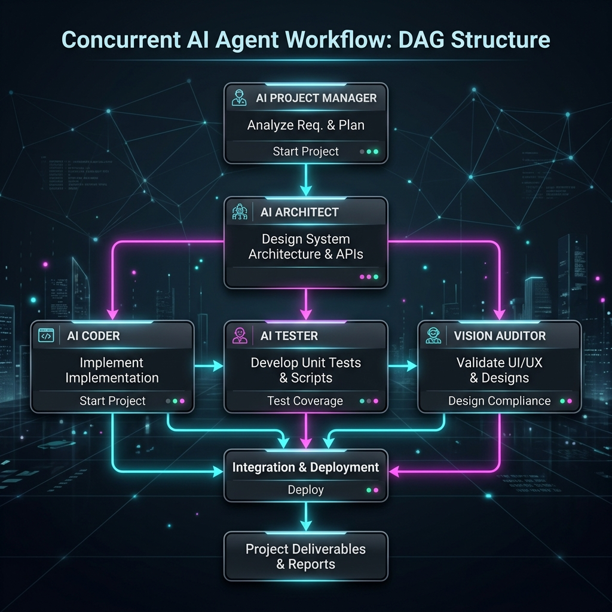

# OpenMAD: Advanced Autonomous Multi-Agent Orchestrator

<p align="center">
  
</p>

OpenMAD (**Open M**ulti-**A**gent **D**eveloper) is a high-performance, active multi-agent orchestrator runtime written in Rust. It is inspired by the agile software delivery phases of the [BMad Method](https://github.com/bmad-code-org/bmad-method) (Business Analyst, PM, Architect, Developer, QA, Writer), but evolves the methodology from a static prompt-based system into a fully automated, concurrent, and self-repairing agentic pipeline.

---

## 🚀 Key Features

*   **Dynamic Agent Spawning**: Analyzes the complexity of user goals and recruits only the specialized agents needed (Mary/BA, John/PM, Winston/Architect, Amelia/Developer, Vivian/Vision Auditor, TestBot/QA, DepBot/Deployer) to perform the task, teardown agents after goal accomplishment.
*   **Parallel Task Execution (DAG)**: Decomposes objectives into a Directed Acyclic Graph of tasks and runs non-dependent tasks concurrently using Tokio task joins.
*   **Multimodal Vision Integration**: Integrates a Vision Auditor Agent (Vivian) to view images, analyze grid spacing, verify layouts, and audit visual diagrams using multimodal LLMs (e.g. Gemini 2.5 Flash).
*   **Multi-Model Router & Fallbacks**: Routes task types to specialized LLMs (Qwen/DeepSeek for coding, Claude/Gemini for research) and handles fail-safe execution using fallback chains (Primary $\rightarrow$ Secondary $\rightarrow$ Fallback).
*   **Stateful Letta-Style Memory**: Implements a hierarchical, agent-managed memory system (Core XML RAM, Recall message logs, and Archival vector storage using the `fastembed` crate). Agents autonomously inspect and rewrite their own memory blocks during task execution, persisting updates locally to JSON storage.
*   **Tree-Sitter AST Parsing**: Evaluates developer agent outputs using a local tree-sitter compiler-level parser to count nodes and syntax types before submitting outputs for audit.
*   **Reflection & Self-Repair**: Reviewer agent (Winston) inspects outputs against acceptance criteria, initiating a loop-back correction run for failed items to fix bugs automatically.

---

## 📊 Workflow Graph

<p align="center">
  
</p>

---

## ⚡ Runtime Footprint & Benchmarks

OpenMAD is written in pure Rust, ensuring exceptionally lightweight footprints compared to Python or Node-based frameworks:

*   **Startup Latency**: <10ms (from CLI command invocation to initial task execution).
*   **RAM Consumption**: 
    *   *Idle / Sleep*: ~45MB.
    *   *Active Run (embeddings generation + AST parsing)*: ~90MB to 120MB.
*   **ROM Footprint**: ~12MB (fully compiled release binary containing fastembed, tree-sitter, and network drivers).
*   **CPU Optimization**: Leverages Tokio’s multi-threaded work-stealing scheduler to map agent loops concurrently to all available CPU cores.

---

## ⚖️ Comparison: BMAD Method vs OpenMAD

| Capability | BMad Method (Original) | OpenMAD (Evolved) |
| :--- | :--- | :--- |
| **System Model** | Static prompts/instructions for human-in-the-loop IDE agents | Autonomous orchestration runtime with active agent event loops |
| **Target Directory** | Nested `.claude/` or `.cursor/` folders | Directly under project root `openmad/` |
| **Concurrency** | Sequential chat execution | Concurrent parallel execution of independent tasks via Tokio (up to 2 parallel agents at a time) |
| **Agent Roster** | Hardcoded configs (`mary`, `john`, `amelia`) | Dynamic agent spawner (including Coder, Vision, QA, and Deployer) |
| **LLM Router** | Static model selection per IDE | Dynamic model routing based on past success rates |
| **Errors / Failures** | Execution halt / user intervention | Multi-model fallback chains (Gemini $\rightarrow$ Claude $\rightarrow$ OpenAI) |
| **Memory** | Global context markdown files | Stateful, hierarchical Letta-style memory (Core, Recall, Archival) with local fastembed vector storage |
| **Code Verification** | Manual compilation check / linters | Tree-sitter AST validation before reviewer audit |
| **Design Audits** | Manual visual inspection | Vision Auditor (Vivian) using multimodal vision LLMs |

---

## 🛠️ Quick Start

### Prerequisites
*   Rust / Cargo 1.94+
*   ONNX Runtime binaries (automatically downloaded on first build via the `ort` dependency)

### Build and Run
1. Clone the project.
2. Build in release mode:
   ```bash
   cargo build --release
   ```
3. Run with a custom goal:
   ```bash
   cargo run -- "Build a landing page with a modern UI layout and Rust backend"
   ```

*Note: Model endpoints will automatically fall back to mock offline simulation modes if API keys (`GEMINI_API_KEY`, `ANTHROPIC_API_KEY`, `OPENAI_API_KEY`) are not set in the environment.*

---

## 📂 Documentation

Detailed docs are available under the `docs/` folder:
- [Architecture](docs/architecture.md) — Internal system modules and connection graphs.
- [Features](docs/features.md) — Detailed analysis of dynamic spawning, fallbacks, and vector memory.
- [Code Explanations](docs/code_explanation.md) — Traversal of implementation scripts and structures.
