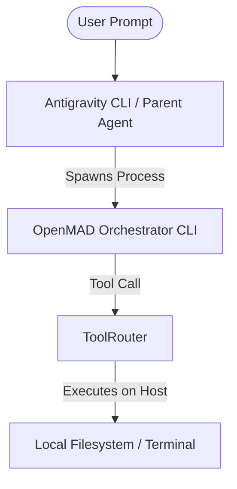

# MCP and Tool Integration Architecture (OpenMAD)

This document describes how OpenMAD interfaces with tools and Model Context Protocol (MCP) servers, and explains how tool access is inherited and routed from the parent host (e.g., Antigravity CLI) down to individual orchestrator agents.

---

## 1. How Tool Access is Inherited

When you run OpenMAD via a parent agent like the Antigravity CLI, the execution follows an **inherited sandbox pipeline**:



### Context Inheritance
1. **Execution Sandbox**: Antigravity runs commands in the user's terminal environment. When Antigravity executes `openmad`, the OpenMAD binary inherits the exact environment variables, user permissions, and working directory of the parent sandbox.
2. **Native Tool execution**: Because OpenMAD runs as a native binary, it doesn't need to ask Antigravity for permission to read or write files. The OpenMAD [ToolRouter](file:///home/aswin/programming/vscode/myProjects/ai_agent_tools/openmad/src/tool_router.rs) directly reads the disk using Rust’s native `std::fs` and executes commands using `std::process::Command`.

---

## 2. Shared MCP / Tool Gateway Design

To support external MCP servers (such as a database client, a GitHub interface, or Chrome Devtools), OpenMAD routes all requests through a **centralized orchestrator gateway** rather than having each agent run its own connection.

```text
                        ┌───────────────────────────────┐
                        │      Orchestrator Process     │
                        │                               │
┌──────────────┐        │    ┌─────────────────────┐    │        ┌──────────────┐
│  Developer   │ ───────┼──> │                     │    │ ──────>│ Postgres MCP │
│    Agent     │        │    │                     │    │        └──────────────┘
└──────────────┘        │    │     ToolRouter      │    │
                        │    │  (Shared MCP Pool)  │    │
┌──────────────┐        │    │                     │    │        ┌──────────────┐
│  Vision Aud  │ ───────┼──> │                     │    │ ──────>│ Chrome MCP   │
│    Agent     │        │    └─────────────────────┘    │        └──────────────┘
└──────────────┘        └───────────────────────────────┘
```

### Why a Shared Gateway?
- **Resource Efficiency**: Spawning MCP servers consumes memory and processes. A shared pool opens one connection per server definition.
- **State Synchronization**: Sharing one connection to servers (like a browser or database) ensures that actions taken by a coding agent are immediately visible to the vision auditing agent.

---

## 3. Implementing MCP Client Configuration in OpenMAD

To add an external MCP server config, we can introduce a config file format, `mcp_config.json`, in the workspace root:

```json
{
  "mcpServers": {
    "sqlite-db": {
      "command": "npx",
      "args": ["-y", "@modelcontextprotocol/server-sqlite", "--db", "data.db"]
    },
    "github": {
      "command": "npx",
      "args": ["-y", "@modelcontextprotocol/server-github"],
      "env": {
        "GITHUB_PERSONAL_ACCESS_TOKEN": "your_token_here"
      }
    }
  }
}
```

### Proposed Rust Integration Scheme

To connect OpenMAD to these servers, we spawn the commands as subprocesses and communicate via standard input/output using JSON-RPC 2.0 (the MCP transport specification):

```rust
use std::process::{Command, Stdio, Child};
use std::io::{Write, BufReader, BufRead};

pub struct McpServerConnection {
    child: Child,
}

impl McpServerConnection {
    pub fn new(command: &str, args: &[String]) -> Self {
        let child = Command::new(command)
            .args(args)
            .stdin(Stdio::piped())
            .stdout(Stdio::piped())
            .spawn()
            .expect("Failed to start MCP server");
        Self { child }
    }

    pub fn call_tool(&mut self, method: &str, params: serde_json::Value) -> String {
        let stdin = self.child.stdin.as_mut().unwrap();
        let stdout = self.child.stdout.as_mut().unwrap();
        
        let request = serde_json::json!({
            "jsonrpc": "2.0",
            "id": 1,
            "method": method,
            "params": params
        });

        let req_str = request.to_string();
        writeln!(stdin, "{}", req_str).unwrap();

        let mut reader = BufReader::new(stdout);
        let mut response = String::new();
        reader.read_line(&mut response).unwrap();
        response
    }
}
```

### Routing Tool Calls dynamically
Inside the [ToolRouter](file:///home/aswin/programming/vscode/myProjects/ai_agent_tools/openmad/src/tool_router.rs), if a tool name is not native, the orchestrator inspects the shared MCP connection list:

```rust
pub fn execute_tool(&mut self, tool_name: &str, args: &str) -> anyhow::Result<String> {
    if self.is_native(tool_name) {
        return self.execute_native(tool_name, args);
    }
    // Check dynamic MCP servers registered at Orchestrator level
    if let Some(mcp_conn) = self.mcp_connections.get_mut(tool_name) {
        let params = serde_json::from_str(args)?;
        let mcp_res = mcp_conn.call_tool(tool_name, params);
        return Ok(mcp_res);
    }
    Err(anyhow::anyhow!("Tool not found: {}", tool_name))
}
```
This ensures that the LLM models driving the individual agents can call external tools directly, while the connection logic is completely centralized in the orchestrator.
